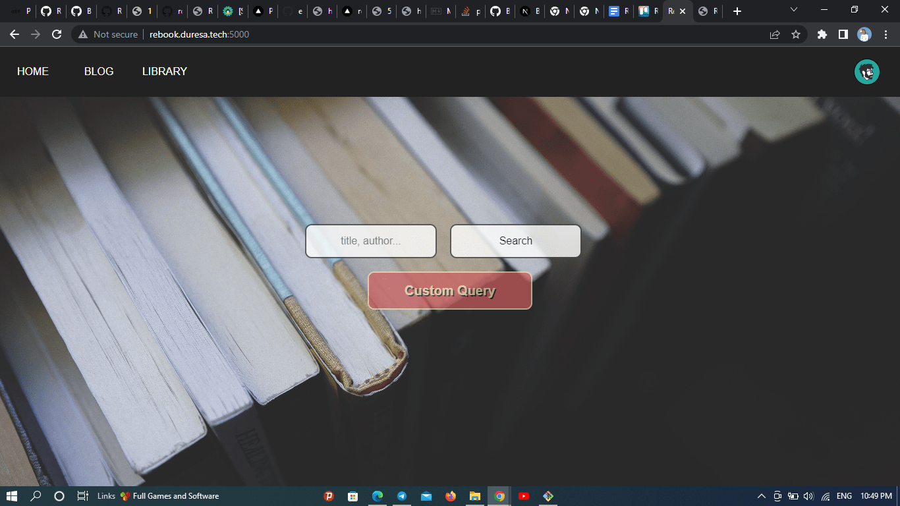
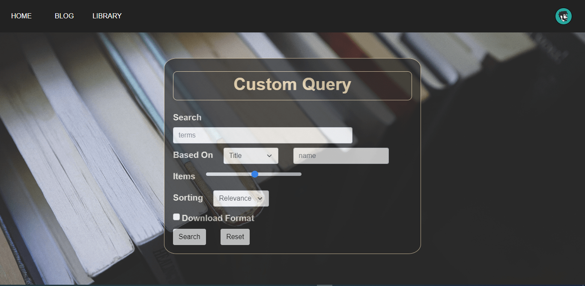
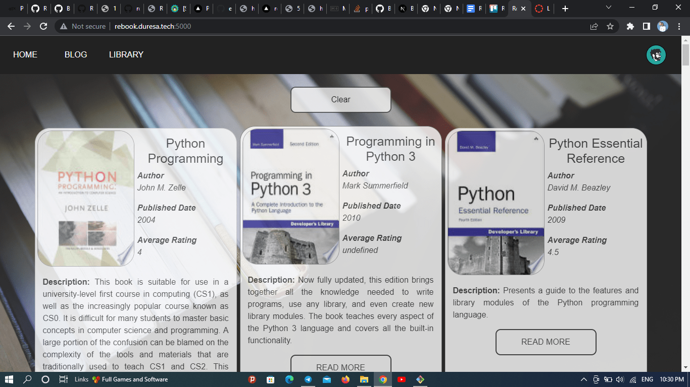
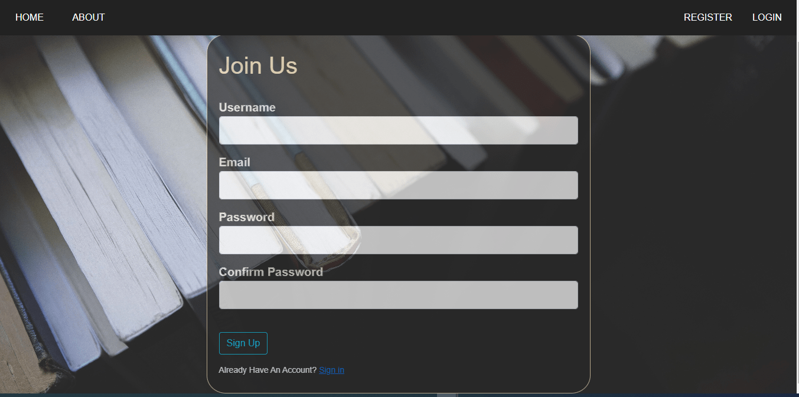
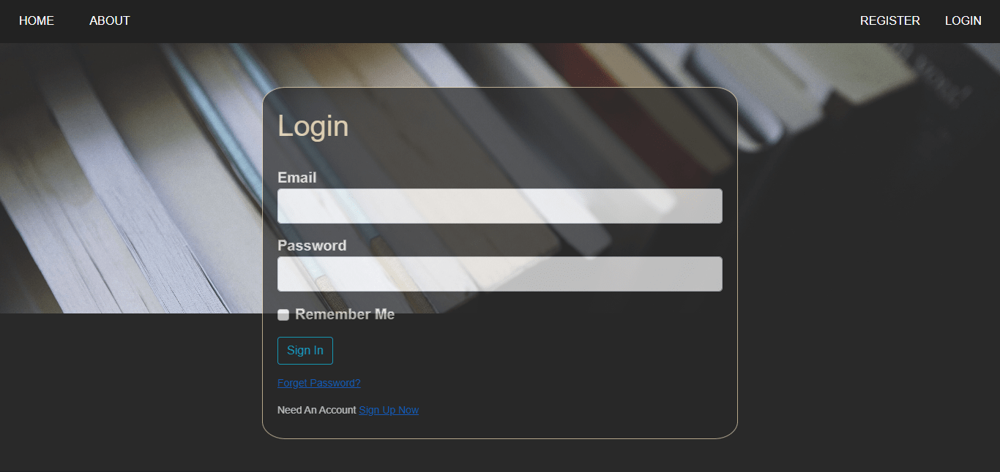
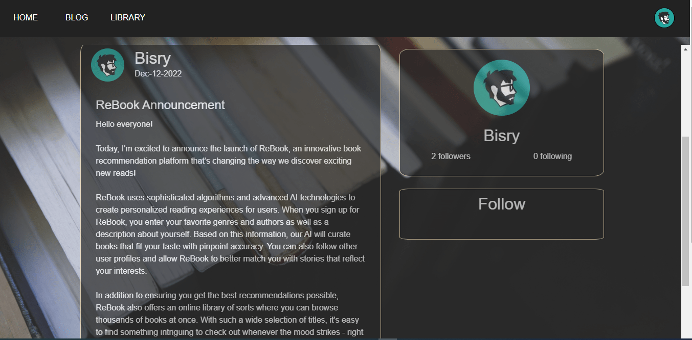
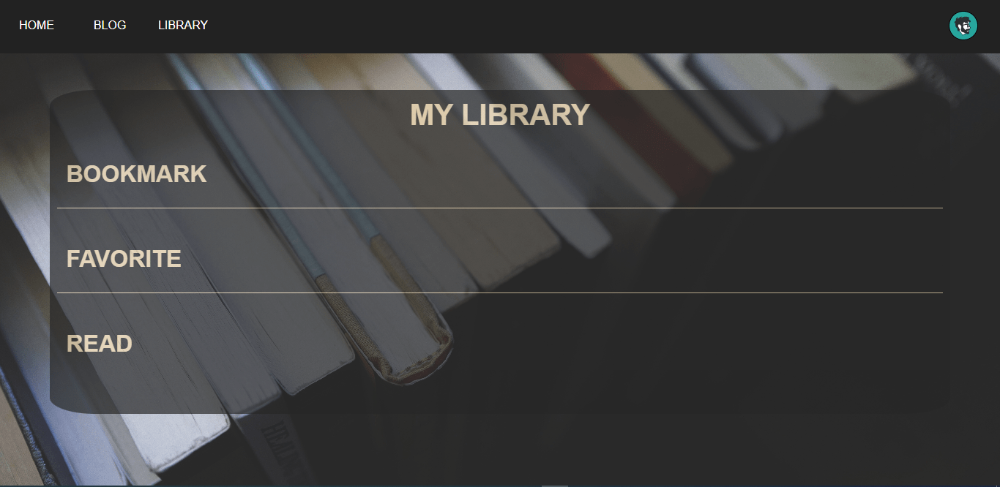

<p align="center">
 
# ReBooK
## Get the Book you always wanted

Welcome to ReBook!

ReBook is a book recommendation website made with Python Flask. Our goal is to help everyone discover and explore new books in a fun and easy-to-use way. 

</p>
>ReBook makes personalized book recommendations for each user based on the user's profile and personal preferences. Users can search for books by author, genre or title, or simply browse our library of recommended titles. The site also allows users to post about their favorite book or the book they are reading while the can also follow a specific user post by following as and more. 

We hope ReBook helps you find new books to love! Enjoy exploring our library of books and let us know what you think. Happy reading!

## DEMO
[https://rebook.duresa.tech](http://rebook.duresa.tech:5000/)

## Run the Application locally

### Install Requirements
```bash
./script.sh
```

### Run The Application
>In order to run the app your have create a google account and generate application password.
>It is used to send verification email to users.
>>Otherwise it generate error.

<details open>
 <summary>
  Stepsteps to generate google gmail application password (Click to expand)
 </summary>

 >To generate a new password for an email program to access your Gmail account through IMAP or POP with two-step authentication enabled
>>- Select your profile icon in the upper-right corner of Gmail, then select Manage Google Account.

 :max_bytes(150000):strip_icc():format(webp)/002_get-a-password-to-access-gmail-by-pop-imap-2-1171882-694a421d0e174036823a8c78070a7891.jpg)
 
>>- Select Security in the left sidebar.
>>- Select App passwords under the Signing into Google section. You're then asked to confirm your Gmail login credentials.
>>- Under Select app, choose Mail or Other (Custom name), then select a device.
>>- Select Generate.
>>- Your password appears in a new window. Follow the on-screen instructions to complete the process, then select Done.
>>- You will not see the password again, so type or paste the password into the email program immediately.

</details>

After getting your Application password run the following command by replacing `[YOUR EMAIL] [YOUR APP PASSWORD]` by your email and app password you created, respectively. 

```
./run.sh [YOUR EMAIL] [YOUR APP PASSWORD]
```

Your ReBook flask Application is Running on ` http://0.0.0.1:5001 `

## Screenshots








Made in Ethiopia by [BisRy](https://github.com/bisryy) and [Duresa](https://github.com/duressa-feyissa) for [ALx](https://alx.app) Project.
